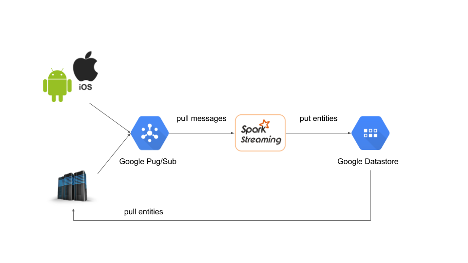

# Example to Integrate Spark Streaming with Google Cloud at Scale

This is an example to integrate Spark Streaming with Google Cloud products.
The streaming application pulls messages from Google Pub/Sub directly without Kafka, using custom receivers.
When the streaming application is running, it can get entities from Google Datastore and put ones to Datastore.

What I want to show here is that we can be free from managing some big data products, such as Kafka and Cassandra.
We data scientist can focus on implementing logics with Spark Streaming.



## Requirments

- Google Cloud account
    - Need privilege to use Google Pub/Sub topics and subscriptions, Google Datastore and Google Dataproc.
- Google Cloud SDK
    - version 147.0.0 or later
    - `gcloud` coomand is required

## How to Run

1. Create Google Pub/Sub topic/subscription
  - ```
    gcloud beta pubsub topics create $TOPIC_NAME`
    ```
2. Create a Spark cluster on Google Dataproc with `make create-dataproc-cluster`
  - ```
    gcloud dataproc clusters create $CLUSTER_NAME \
        --zone="us-central1-a" \
        --image-version=1.1 \
        --master-machine-type="n1-standard-4" \
        --num-workers=2 \
        --worker-machine-type="n1-standard-4" \
        --scopes=https://www.googleapis.com/auth/pubsub,https://www.googleapis.com/auth/datastore,https://www.googleapis.com/auth/bigquery,https://www.googleapis.com/auth/devstorage.read_write,https://www.googleapis.com/auth/logging.write
    ```
3. Create a JAR file of the project
  - ```
    make assembly
    ```
4. Submit a Spark Streaming job to Google Dataproc
  - ```
    ./bin/submit-streaming-job.sh $GOOGLE_PROJECT_ID $PUBSUB_TOPIC
    ```
5. Send Pub/Sub messages
  - ```
    ./bin/send-pubsub-messages.sh $GOOGLE_PROJECT_ID $PUBSUB_TOPIC
    ```

Please make sure to delete a Pub/Sub topic and a Dataproc cluster.

## Appendix: Price Estimation for Google Pub/Sub and Google Datastore

As you know, [Google Cloud Platform Pricing Calculator](https://cloud.google.com/products/calculator/) allows us to estimate how much cost we need to run systems.
I would like to show an example cost to use Google Pug/Sub and Google Datastore.
Of course, we need extras cost to use Spark Streaming on Google Dataproc.

According to the calculator, the estimated amount is just $22.20 per 1 month.
From my perspective, it is much more reasonable than the cost of having an own Kafka cluster and a Cassandra cluster.

The cost was estimated with the following condition:
- Google Datastore: $16.60
    - Stored data: 50 GB
    - Entity Reads: 10,000,000
    - Entity Writes: 5,000,000
    - Entity Deletes: 1,000,000
- Cloud Pub/Sub: $6.00
    - Volume of message data: 100 GB

## Appendix: How to Avoid Conflicts on `protobuf-java` Versions

Apache Spark 2.0.2 uses `protobuf-java` 2.5.
Meanwhile, we need to `protobuf-java` 3.0 or later for Google Datastore.
We can't avoid this conflict on `protobuf-java` event with any eviction.

In stead of any eviction, `sbt-assembly` offers an excellent feature to resolve this issue.
Please take a look [./build.sbt](./build.sbt) in the repository.
```
assemblyShadeRules in assembly := Seq(
  ShadeRule.rename("com.google.protobuf.*" -> "shadedproto.@1").inAll
)
```

### Reference
- [Win over Spark distribution's dependency conflicts with SBT shading](http://www.yonatanwilkof.net/spark-dependency-conflict-jackson-sbt-shade-plugin/)
- [sbt/sbt\-assembly: Deploy fat JARs\. Restart processes\. \(port of codahale/assembly\-sbt\)](https://github.com/sbt/sbt-assembly)
